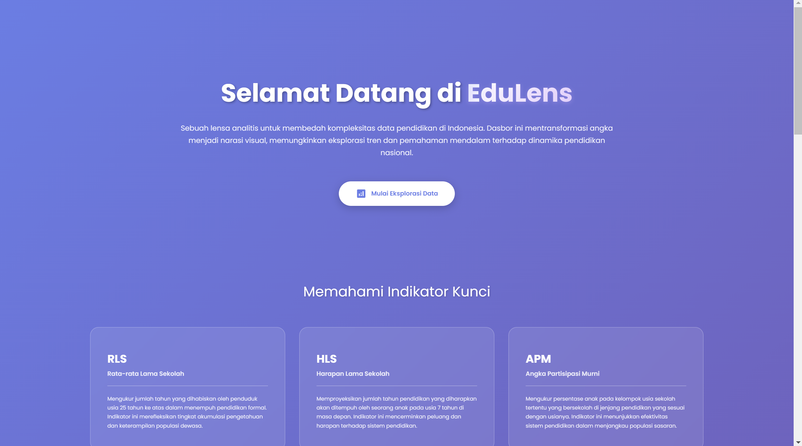
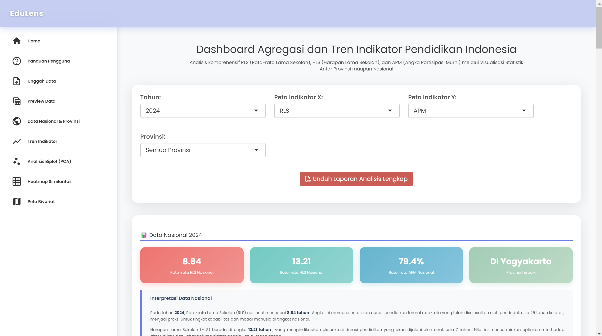
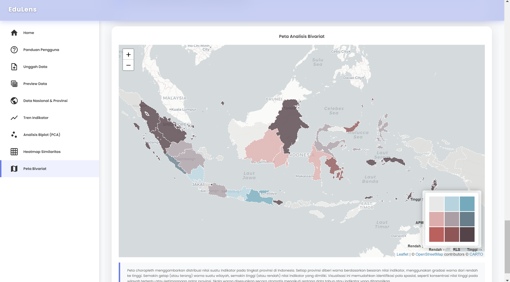

# EduLens: Dashboard Analisis Indikator Pendidikan Indonesia

Dasbor interaktif yang dibangun dengan R dan Shiny untuk menganalisis dan memvisualisasikan data indikator pendidikan kunci di seluruh provinsi di Indonesia.

🌐 Live App
Silakan akses EduLens Dashboard ini secara online melalui link berikut:
https://s.stis.ac.id/EduLens

## View Dashboard




---

## Deskripsi Proyek

**EduLens** adalah sebuah aplikasi web analitis yang dirancang untuk mentransformasi data statistik pendidikan yang kompleks menjadi wawasan yang dapat ditindaklanjuti. Aplikasi ini memberikan para pemangku kepentingan, peneliti, dan publik akses untuk mengeksplorasi tren dan memahami dinamika lanskap pendidikan di Indonesia.

Fokus utama dasbor ini adalah analisis tiga indikator kunci dari Badan Pusat Statistik (BPS):
* **Rata-rata Lama Sekolah (RLS):** Merefleksikan tingkat pendidikan aktual yang diselesaikan oleh populasi dewasa.
* **Harapan Lama Sekolah (HLS):** Memproyeksikan ekspektasi dan aksesibilitas sistem pendidikan untuk generasi mendatang.
* **Angka Partisipasi Murni (APM):** Mengindikasikan efektivitas sistem pendidikan dalam menjangkau populasi usia sekolah pada jenjang yang relevan.

## Fitur Utama

* **Dasbor Interaktif:** Visualisasi data yang dinamis dan responsif terhadap input pengguna, seperti pemilihan tahun dan provinsi.
* **Analisis Komparatif:** Menyajikan data statistik agregat di tingkat nasional dan perbandingan detail untuk setiap provinsi, dilengkapi dengan interpretasi statistik.
* **Visualisasi Data Multi-dimensi:**
    * **Analisis Tren:** Grafik garis untuk memantau perkembangan indikator dari waktu ke waktu.
    * **Analisis Spasial:** Peta Bivariat interaktif untuk menganalisis korelasi spasial antara dua indikator.
    * **Analisis Komponen Utama (PCA):** Biplot untuk memetakan hubungan antar variabel dan posisi relatif setiap provinsi.
    * **Analisis Similaritas:** Heatmap untuk mengelompokkan provinsi berdasarkan kemiripan profil indikator pendidikannya.
* **Fungsionalitas Unggah Data:** Memungkinkan pengguna untuk mengunggah dan menganalisis set data mereka sendiri (`.xlsx` atau `.csv`).
* **Manajemen Data:** Termasuk fitur pratinjau data interaktif dan fungsi untuk me-reset kembali ke data default.
* **Ekspor Laporan:** Opsi untuk mengunduh laporan analisis lengkap dalam format PDF dan mengekspor visualisasi sebagai gambar (`.png`).

---

## Teknologi yang Digunakan

Proyek ini dibangun menggunakan ekosistem R dengan beberapa pustaka inti sebagai berikut:
* **Aplikasi Web:** `shiny`
* **Manipulasi Data:** `dplyr`, `tidyr`
* **Visualisasi:** `plotly`, `leaflet`
* **Tabel Interaktif:** `DT`
* **UI & UX:** `shinyjs`
* **Pelaporan:** `rmarkdown`
* **Utilitas:** `readxl`, `sf`, `htmlwidgets`, `webshot`

---

## Panduan Instalasi dan Penggunaan

Untuk menjalankan dasbor ini secara lokal, ikuti langkah-langkah di bawah ini.

1.  **Clone Repositori**
    ```bash
    git clone [https://github.com/NAMA_USERNAME_ANDA/NAMA_REPO_ANDA.git](https://github.com/NAMA_USERNAME_ANDA/NAMA_REPO_ANDA.git)
    cd NAMA_REPO_ANDA
    ```

2.  **Instal Dependensi**
    Buka R atau RStudio, lalu jalankan skrip berikut di konsol untuk menginstal semua pustaka yang dibutuhkan:
    ```r
    install.packages(c("shiny", "shinyjs", "plotly", "dplyr", "tidyr", "readxl", "leaflet", "sf", "DT", "htmlwidgets", "webshot", "rmarkdown"))
    
    # Untuk fungsionalitas unduh grafik, instalasi PhantomJS mungkin diperlukan.
    # Jalankan perintah ini jika belum terinstal.
    webshot::install_phantomjs()
    ```

3.  **Jalankan Aplikasi**
    Di dalam direktori proyek, jalankan perintah berikut pada konsol R:
    ```r
    shiny::runApp()
    ```
    Aplikasi akan berjalan dan dapat diakses melalui browser web Anda.

---


## Kontribusi

Kami menyambut baik kontribusi dari komunitas. Jika Anda tertarik untuk berkontribusi, silakan ikuti alur standar berikut:
1.  *Fork* repositori ini.
2.  Buat *branch* fitur baru (`git checkout -b fitur/NamaFitur`).
3.  *Commit* perubahan Anda (`git commit -m 'Menambahkan fitur X'`).
4.  *Push* ke *branch* tersebut (`git push origin fitur/NamaFitur`).
5.  Buat *Pull Request* baru untuk kami tinjau.

---

## Lisensi

Proyek ini dilisensikan di bawah **Lisensi MIT**. Silakan merujuk ke file `LICENSE` untuk informasi lebih lanjut.

---

Dibuat oleh **Kelompok 12**
- Danang Ivan Pangestu
- Xavier Yubin Raditio
- Irish Shanty Kinsela Putri
